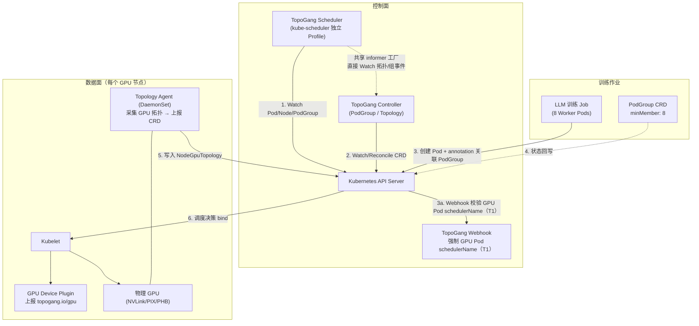
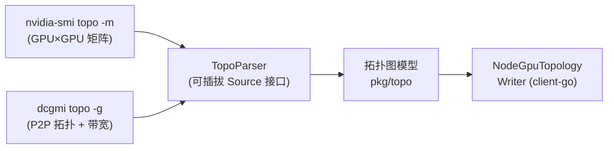
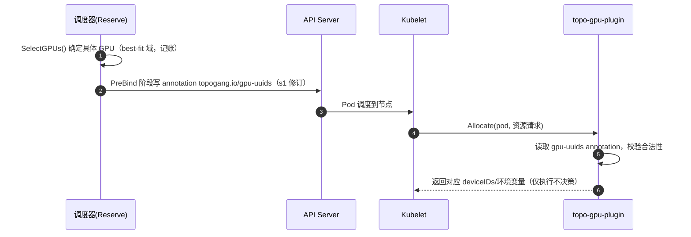
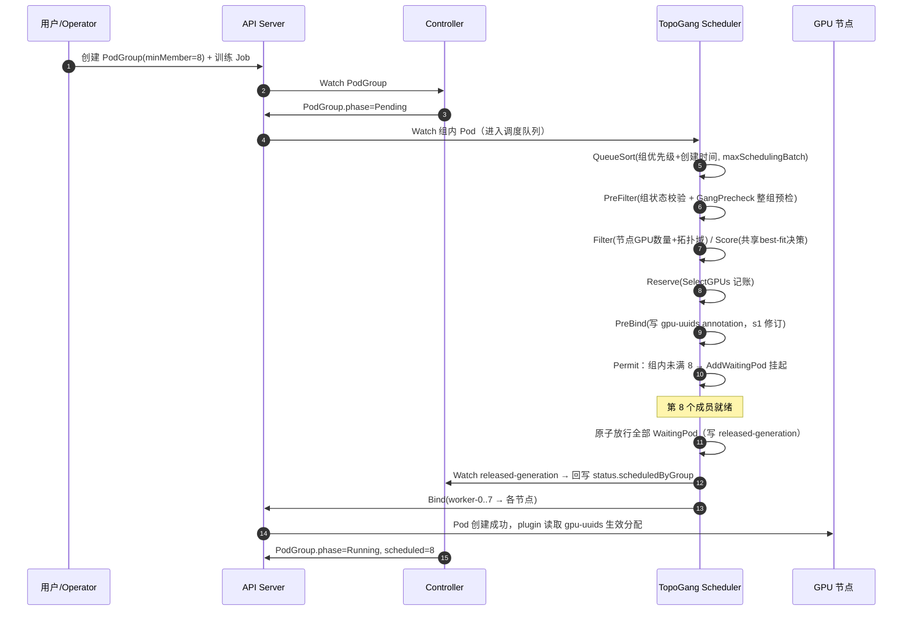
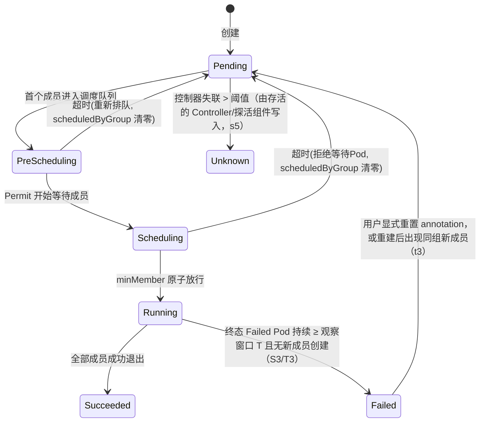

# TopoGang 设计文档

> 基于 Kubernetes 的 GPU 拓扑感知与 Gang 调度器
>
> 版本：v0.6（评审修订版 5）
> 状态：设计定稿，M1/M2 已完成、M3 进行中（见文末"实现状态"）
> 适用范围：大模型分布式训练（PyTorch DDP / DeepSpeed / Megatron-LM / FSDP）在 K8s 上的资源调度
> 修订记录：v0.2 依据 `docs/REVIEW.md` 修复 C1/C2/C3 关键问题及 M1–M5、m1–m6；
> v0.3 依据 `docs/REVIEW.md` 第二轮评审修复 N1–N9（batch 计数口径 / 超卖安全阀 / 快速失败路径等）；
> v0.4 依据 `docs/REVIEW.md` 第三轮评审修复 R1–R12（Permit 放行 off-by-one / 预检作用域 / 兼容模式记账等）；
> v0.5 依据 `docs/REVIEW.md` 第四轮评审修复 S1–S4 及 s1–s16（管理域约束/混部盲区 / 预检缓存 key / 失败终态 / scheduledByGroup 回退清零 / PreBind 写入时机 / 命名与指标口径统一等）；
> v0.6 依据 `docs/REVIEW.md` 第五轮评审修复 T1–T5 及 t1–t7（Pod 级混部盲区 / 拓扑不健康口径统一 / 失败判定观察窗口 / Permit phase 防御与缓存失效 / 孤儿 Pod 区分 / RBAC 与指标口径等）

---

## 目录

1. [项目概述](#1-项目概述)
2. [背景与问题分析](#2-背景与问题分析)
3. [目标与非目标](#3-目标与非目标)
4. [技术选型与竞品分析](#4-技术选型与竞品分析)
5. [总体架构](#5-总体架构)
6. [API 与 CRD 设计](#6-api-与-crd-设计)
7. [模块详细设计](#7-模块详细设计)
8. [调度算法设计](#8-调度算法设计)
9. [状态机与一致性](#9-状态机与一致性)
10. [测试与验证](#10-测试与验证)
11. [部署与可观测性](#11-部署与可观测性)
12. [工程结构](#12-工程结构)
13. [里程碑规划](#13-里程碑规划)
14. [风险与对策](#14-风险与对策)
15. [附录](#15-附录)

---

## 1. 项目概述

**TopoGang** 是面向大模型分布式训练场景的 Kubernetes 调度系统，以 **Scheduler Framework 插件** + **自定义 Controller** 的方式实现两项核心能力：

| 能力 | 解决的问题 | 用户可感知收益 |
|------|-----------|---------------|
| **GPU 拓扑感知调度**（Topology-Aware） | 分布式训练任务被随机拆散到跨 NVLink 域、跨 PCIe Switch、甚至跨节点的 GPU 上，NCCL 集合通信退化为 PCIe/SYS 路径 | 多卡训练通信延迟降低 50%~90%，吞吐提升 2~5 倍（业界参考，s11：本项目以 §10.3 用例 7 实测为准） |
| **Gang Scheduling**（All-or-Nothing） | 多 Pod 训练任务（如 8 Worker）逐个调度，部分 Pod 占住资源、其余 Pod 永远等不到，形成资源死锁与碎片 | 任务排队无死锁，资源按"整组"腾挪，集群利用率提升 |

### 1.1 项目亮点（简历 / 面试口径）

- **调度内核**：基于 K8s `scheduler-plugins` 框架实现 7 个扩展点（QueueSort / PreFilter / Filter / PostFilter / Score / Reserve / Permit）。
- **拓扑建模**：自研 GPU 拓扑图模型（NVLink 域 = 图的 clique 划分 + 选团策略），支持 `NV1/NV2/NV3/PIX/PHB/SYS` 六级链路权重。
- **All-or-Nothing**：组级预检（GangPrecheck）+ Permit 原子放行 + 超时回滚三层机制，杜绝永久死锁并将等待期资源占用收敛到毫秒级。
- **可移植性**：拓扑数据采集器与调度逻辑解耦，可平滑切换 `nvidia-smi` / DCGM / 模拟数据源。
- **生产级工程**：双调度器共存、leader 选举、informer 缓存一致性、全链路可观测指标。

---

## 2. 背景与问题分析

### 2.1 分布式训练的资源特征

以 8 卡 A100 单机 + 8 Worker DDP 任务为例：

- 每个 Worker 是一个 Pod，请求 1 张 GPU，任务一共 8 个 Pod（`minMember=8`）。
- Worker 之间每步迭代都要做 AllReduce，**通信发生在 GPU 之间而非网卡之间**（同节点内走 NVLink，跨节点走 RDMA）。
- NCCL 会根据 GPU 间的实际互联自动选择最优通信路径（tree / ring / nvls 等算法）。

### 2.2 痛点一：默认调度器无视 GPU 拓扑

K8s 默认调度器只按资源数量（`nvidia.com/gpu`）分配，不关心"哪张卡"。导致：

```
训练任务 A（4 Pod）被拆到两个 NVLink 域：
  域1（GPU0-3）占 2 张，域2（GPU4-7）占 2 张
→ 域间通信只能走 PIX/SYS 路径，NCCL 全连接带宽从 600GB/s 掉到 32GB/s
→ 性能影响可达 5~10 倍（业界实测数据）
```

**根因**：调度决策缺少"GPU 之间的物理距离"信息维度。

### 2.3 痛点二：Gang 任务的资源死锁与碎片

默认调度器逐 Pod 独立调度，对于"必须整组一起跑"的任务：

```
任务 X：minMember=8，集群只剩 6 张空闲卡
→ 前 6 个 Pod 被调度成功并占用资源
→ 后 2 个 Pod 永远无法调度 → 前 6 个 Pod 空占资源 → 死锁
```

**根因**：缺乏 All-or-Nothing 语义——要么整组满足，要么整组不调度（等待）。

### 2.4 问题抽象

| 维度 | 问题 | 解决方案 |
|------|------|----------|
| 空间 | 任务内 GPU 物理互联不匹配 NCCL 需求 | 拓扑感知打分 + 域内装箱 |
| 时间 | 任务级资源无法原子获得 | Gang Scheduling + 组级预检 + Permit 原子放行 |
| 一致性 | 调度器对 GPU 分配状态的认知漂移 | GPU AllocationTracker + 节点 Agent 对账 |

---

## 3. 目标与非目标

### 3.1 目标

1. **拓扑感知调度**：将训练任务（单个 Pod 多卡 / 多个 Pod 组）的 GPU 尽量放置于同一 NVLink 域，退而求其次最小化跨域边数。（业界实测通信延迟可降 50%~90%、吞吐提升 2~5 倍，s11 修订：本项目收益以 §10.3 用例 7 实测为准）
2. **Gang Scheduling**：支持 `minMember` 原子调度、组级超时、组级优先级抢占。
3. **API 友好**：提供 `PodGroup` 与 `NodeGpuTopology` 两个 CRD，训练作业（Job 模板）只需加一行 annotation。
4. **可观测**：暴露调度延迟、排队时长、拓扑命中率、资源碎片率等指标。

### 3.2 非目标（本期不做）

- 不做 GPU 显存分片 / MIG 调度（整卡粒度）。
- 不做任务级弹性（interruptible gang）与 FIFO 之外的复杂队列模型（预留扩展）。
- 不做节点间 RDMA 网络拓扑感知（版本 2 规划）。
- 不做 GPU–CPU / NUMA 对齐调度（字段已在 `NodeGpuTopology.spec.gpus[].numaNode` 预留，v2 纳入打分）。
- 不接管已有训练框架（TF/PyTorch 等），只做资源调度层。
- **部署约束（S1/T1 修订）**：GPU 级记账、`locked` 安全阀与 `gpu-uuids` 链路仅对**管理域**生效——管理域定义为"GPU 节点全量使用自研 `topo-gpu-plugin`（`topogang.io/gpu`）**且** GPU Pod 均指定 `schedulerName: topogang-scheduler`（由 admission webhook 强制校验，见 §11.1，webhook 未部署即视为不满足管理域条件）"。混部（默认调度器 GPU Pod / 官方插件节点）会扩大物理占用盲区，本期仅支持管理域内全量接入，混部节点走降级路径（§7.4 / §11.1）；管理域内节点上出现的非 topogang 分配 GPU 占用由 agent 打 `locked` 兜底（§7.3.3）。

---

## 4. 技术选型与竞品分析

### 4.1 技术栈

| 层 | 选型 | 理由 |
|----|------|------|
| 语言 | Go 1.22+ | K8s 生态标准语言，scheduler-plugins 官方依赖 |
| 调度框架 | K8s **Scheduler Framework**（kube-scheduler 扩展） | 官方扩展点机制，避免 fork 主调度器，可独立 profile 部署 |
| CRD 运行时 | controller-runtime（kubebuilder 脚手架） | 标准 controller 开发框架 |
| 拓扑数据源 | `nvidia-smi topo -m` + DCGM（`dcgmi topo -g`） | 官方工具，无需私有驱动接口；设计为可插拔 Source 接口 |
| 资源上报 | 自研轻量 Device Plugin（上报 `topogang.io/gpu`） | 复用 NVIDIA 官方插件亦可（`nvidia.com/gpu`），见 §7.4 |
| 测试 | ginkgo + envtest + kind + 拓扑模拟器 | 无 GPU 环境下可完整验证调度算法 |

### 4.2 竞品 / 参考方案对比

| 方案 | 实现方式 | Gang | GPU 拓扑感知 | 可借鉴点 | 不足 |
|------|----------|------|-------------|----------|------|
| **Kueue** | 队列管理层（Workload / ClusterQueue）+ 标准调度器 | ✅ Workload 内 gang 语义 | ❌ 无 | 社区 Batch 调度的**官方推荐路径**，配额/队列模型成熟 | 属"队列管理"而非"调度内核"；拓扑感知仍需扩展 Filter/Score |
| **Volcano** | 独立调度器（框架重写） | ✅ 队列 + PodGroup + placeholder | ❌ 无 | 队列模型、PodGroup 状态机 | 需替换默认调度器，学习成本高，拓扑感知需自研 |
| **scheduler-plugins / coscheduling** | Scheduler Framework 插件 | ✅ Permit 原子放行 | ❌ 无 | 插件架构、扩展点实现范式 | 仅做 Gang，无拓扑维度；社区已进入维护模式 |
| **KubeFlow gputopology** | 调度插件 + allocation tracker | ❌ | ✅ 节点内 NVLink 域 | GPU 分配追踪机制 | 无 Gang、无组级优化，维护停滞 |
| **Run:ai / 商业化** | 商业 | ✅ | ✅ | 拓扑域 + 网络域联合调度 | 闭源 |
| **TopoGang（本项目）** | Framework 插件 + CRD | ✅ | ✅ | —— | 从零建设，需自行验证生产稳定性 |

**选型论证（C3 修订）**：

本项目定位是**调度内核层**（在 Filter/Score/Permit 扩展点内实现拓扑感知与组级原子放行），而 Kueue 是**队列管理层**（Workload/ClusterQueue 的排队与配额），二者不在同一层。选择 `scheduler-plugins` 作为底座的理由：

1. 能在扩展点内直接实现"拓扑 + Gang"调度内核能力——这是本项目（简历项目）的核心展示价值，深度进入 Filter/Score 才能体现调度内核能力。
2. 以独立 `schedulerName` 与默认调度器共存，可灰度、可回退。

**不基于 Kueue 扩展的理由**：Kueue 的 Workload 是"组级排队 + 配额"抽象，GPU 拓扑感知仍需自定义 Scheduler Profile 深入 Filter/Score——等于"Kueue + 本项目的调度插件"，工程量大且调度内核的展示度被 Kueue 遮蔽。

**兼容策略**：`PodGroup` API 字段对齐社区 `workloads.k8s.io/PodGroup` 提案（`minMember` / `scheduleTimeoutSeconds` / priority），后续如需接入 Kueue 做多租户队列，可增加 `Workload ↔ PodGroup` 适配层，不破坏现有调度逻辑。Pod 关联 annotation **统一为 `scheduling.topogang.io/group-name`**（语义对齐社区、仅名称空间不同，避免与官方保留注解冲突，s7 修订）。

---

## 5. 总体架构

### 5.1 架构图



### 5.2 组件清单

| 组件 | 类型 | 职责 | 高可用 |
|------|------|------|--------|
| `topogang-scheduler` | Deployment（独立 kube-scheduler 二进制的插件扩展） | 实现 Gang / Topology 两个调度插件 | leader election，多副本 |
| `topogang-controller` | Deployment | 管理 PodGroup / NodeGpuTopology 生命周期与状态 | leader election |
| `topo-agent` | DaemonSet | 每节点采集 GPU 拓扑并上报 NodeGpuTopology | 跟随节点 |
| `topo-gang-webhook` | Deployment（Validating/Mutating） | 强制 GPU Pod `schedulerName` + 校验 annotation 一致性（T1，管理域默认要求） | 多副本 |
| `topo-gpu-plugin` | DaemonSet | GPU 资源上报与分配生效（device plugin，仅执行不决策） | 跟随节点 |

### 5.3 调度数据流（端到端）

1. 用户创建训练 Job，Pod 带 annotation `scheduling.topogang.io/group-name: llm-train-a`，`schedulerName: topogang-scheduler`。
2. `topogang-controller` 创建/更新对应 `PodGroup`（或用户预创建）。
3. 调度器为组内每个 Pod 依次执行：
   - **QueueSort**：按组优先级 + 组创建时间排序（`maxSchedulingBatch` 并发限制由 PreFilter active 计数实现，s3 修订）。
   - **PreFilter**：校验组状态 + **组级预检（GangPrecheck）**——整组无法满足则拒绝，不进 Reserve。
   - **Filter**：节点 GPU 数量与拓扑域容量（+ 强制 `nvlink` 时域内容量检查）。
   - **Score**：共享 best-fit 决策函数的拓扑内聚度打分（域内聚 + 兄弟亲和 + 装箱平衡）。
   - **Reserve**：按 best-fit 决策选具体 GPU 并写入 AllocationTracker（纯账本操作，不修改 Pod 元数据）。
   - **PreBind**：把 GPU 列表写入 Pod annotation `topogang.io/gpu-uuids`（s1 修订：由 Reserve 移至 PreBind，避免未放行即持久化修改 Pod 元数据的副作用）。
   - **Permit**：组内成员是否全部就绪 → 原子放行（写 `released-generation` annotation）或等待。
4. 全部成员放行后，调度器逐个 Bind；kubelet 侧 device plugin 读取 annotation 生效分配。
5. `topo-agent` 监听 Pod annotation 回填实际分配，周期校验与 AllocationTracker 是否一致，漂移仅告警不覆盖（见 §9.3）。

---

## 6. API 与 CRD 设计

API Group 规划：

| Group | Version | 资源 |
|-------|---------|------|
| `scheduling.topogang.io` | `v1alpha1` | `PodGroup` |
| `topology.topogang.io` | `v1alpha1` | `NodeGpuTopology` |

### 6.1 PodGroup

```yaml
apiVersion: scheduling.topogang.io/v1alpha1
kind: PodGroup
metadata:
  name: llm-train-a
  namespace: default
  annotations:
    # 调度器"整组放行事件"序号（compare-and-set 递增；一次整组放行 bump 一次，
    # 与 minMember/成员数解耦，仅表示放行批次）。Controller watch 后回写 status.scheduledByGroup
    scheduling.topogang.io/released-generation: "3"
spec:
  # 组内最少成功调度成员数，调度器保证 "minMember 全部满足才放行"
  minMember: 8
  # 从组开始排队到整组调度的最大等待时间（秒），超时整组回退
  scheduleTimeoutSeconds: 600
  # 组内同时进入"调度 cycle 进行中（PreFilter~Permit 提交）"的最大成员数
  # 计数口径：Permit 返回 Wait 后不计入名额（§8.4，N1 修订）；默认 4，防止大组饿死其他任务
  maxSchedulingBatch: 4
  # 队列名（预留多队列策略，本期为 FIFO）
  queue: default
  # 优先级类：用于跨组抢占排序
  priorityClassName: llm-high
  # 可选：拓扑需求声明
  topologyPolicy:
    # none | nvlink | pcie （本期实现 nvlink）
    gpuDomain: nvlink
status:
  phase: Running        # Pending | PreScheduling | Scheduling | Running | Succeeded | Failed | Unknown
  scheduled: 8          # 已调度成员数
  scheduledByGroup: 8   # 已通过 Permit 原子放行的成员数
  running: 8
  succeeded: 0
  failed: 0
  conditions:
    - type: Scheduled
      status: "True"
      reason: AllMembersReady
      lastTransitionTime: "..."
```

**Pod 关联方式**（Pod annotation）：

```yaml
metadata:
  annotations:
    # 组关联唯一命名（s7 修订：全文档统一为 scheduling.topogang.io/group-name）
    scheduling.topogang.io/group-name: llm-train-a
    # 调度器 PreBind 阶段写入：本 Pod 被分配的 GPU 列表（s1 修订，由 Reserve 移至 PreBind）
    # topogang.io/gpu-uuids: "GPU-xxx,GPU-yyy"
spec:
  schedulerName: topogang-scheduler
  containers:
    - resources:
        limits:
          topogang.io/gpu: "1"     # 或 nvidia.com/gpu: "1"（兼容官方插件）
```

### 6.2 NodeGpuTopology

```yaml
apiVersion: topology.topogang.io/v1alpha1
kind: NodeGpuTopology
metadata:
  name: node-gpu-a100-8
  labels:
    topology.topogang.io/node: gpu-node-01
spec:
  nodeName: gpu-node-01
  # 由 topo-agent 周期采集
  generation: 42            # 递增，供调度器判断缓存是否过期
  source: nvidia-smi         # nvidia-smi | dcgmi | mock
  gpus:
    - id: "00000000:3B:00.0"
      index: 0
      model: "A100-SXM4-40GB"
      nvlinkDomain: "nvlink-1"     # NVLink 域 ID（见 §8.1 算法定义）
      numaNode: 0
      allocatedTo:              # 由 topo-agent 观测 Pod annotation 回填，仅对账用
        - podUID: "xxx"
          podName: "llm-train-a-worker-0"
          namespace: "default"
      peers:                    # 与该 GPU 的互联矩阵（只列有链路/对端）
        - gpuId: "00000000:3C:00.0"
          linkType: NVLink        # NVLink | PIX | PHB | SYS | NVSwitch
          linkSpeed: 600          # GB/s（双向）
        - gpuId: "00000000:89:00.0"
          linkType: PIX
          linkSpeed: 32
  # 聚合视图：NVLink 域 → GPU 集合
  domains:
    - id: "nvlink-1"
      gpuIndexes: [0, 1, 2, 3]
      intraBandwidth: 600        # 域内链路带宽
    - id: "nvlink-2"
      gpuIndexes: [4, 5, 6, 7]
status:
  observedGeneration: 42
  lastHeartbeat: "..."
  healthy: true
  error: ""
```

> 说明：`allocatedTo` 由 topo-agent 监听 Pod 的 `topogang.io/gpu-uuids` annotation（或读取 `/var/lib/kubelet/device-plugins` 信息）回填。**它是对账基准与告警来源，不是调度器记账的写入源**（见 §7.3.3 / §9.3）。
>
> 说明（s6 修订）：`spec.domains` 为 NVLink 域归属的**权威聚合视图**（调度器只读 `domains` 与 `gpus[].nvlinkDomain` 做交叉校验）；topo-agent 写入时保证两者一致，不一致视为采集异常（`status.healthy=false`）。

---

## 7. 模块详细设计

### 7.1 GPU 拓扑采集器（Topo Agent）

**目标**：把物理 GPU 拓扑转化为可调度信息。

**采集链路**：



**核心接口**（`pkg/topo/source.go`）：

```go
// Source 采集原始拓扑数据（不同实现：nvidia-smi / dcgmi / mock）
type Source interface {
    // Discover 返回 GPU 间的拓扑矩阵与设备信息
    Discover(ctx context.Context) (*GpuTopology, error)
}

// GpuTopology 抽象后的拓扑图
type GpuTopology struct {
    NodeName string
    GPUs     []*Gpu
    Links    []*Link   // gpuA <-> gpuB, LinkType, Bandwidth
}

type LinkType string
const (
    LinkNVLink LinkType = "NVLink" // NV1/NV2/NV3 统一为 NVLink，权重按带宽
    LinkPIX    LinkType = "PIX"    // 同 PCIe Switch
    LinkPHB    LinkType = "PHB"    // 同 Root Complex 不同 Switch
    LinkSYS    LinkType = "SYS"    // 跨主机总线（NUMA 间）
)
```

**nvidia-smi topo -m 输出示例**（8×A100，2 个 NVLink 域）：

```
       GPU0   GPU1   GPU2   GPU3   GPU4   GPU5   GPU6   GPU7
GPU0    X     NV1    NV1    NV1    SYS    SYS    SYS    SYS
GPU1    NV1    X     NV1    NV1    SYS    SYS    SYS    SYS
GPU2    NV1    NV1     X     NV1    SYS    SYS    SYS    SYS
GPU3    NV1    NV1    NV1     X     SYS    SYS    SYS    SYS
GPU4    SYS    SYS    SYS    SYS     X     NV1    NV1    NV1
GPU5    SYS    SYS    SYS    SYS    NV1     X     NV1    NV1
GPU6    SYS    SYS    SYS    SYS    NV1    NV1     X     NV1
GPU7    SYS    SYS    SYS    SYS    NV1    NV1    NV1     X
```

→ 解析后得到 `nvlink-1 = {GPU0..3}`、`nvlink-2 = {GPU4..7}` 两个域。

**采集周期与容错**：
- 每 60s 全量采集一次；GPU 分配信息（`allocatedTo`）随 Pod annotation 事件增量更新。
- **降级处置（T2 修订，统一口径）**，按严重程度分两级：
  - **心跳过期（agent 失联）**：`status.healthy=false` 且 `lastHeartbeat` 超阈值（默认 60s×2）→ **完全停止新 GPU 分配**，Filter 直接不返回该节点，不参与记账/选卡；恢复心跳后自动解除（§7.3.3 / §9.3 同步）。
  - **心跳正常但采集失败**（驱动异常 / 设备被占用 / CRD 数据缺失）：保留旧数据并标记 `healthy: false`，调度器对该节点降级为"仅按数量过滤"——数量来源为 `node.status.allocatable[topogang.io/gpu]`（自研插件模式）或 `nvidia.com/gpu`（兼容模式，s9 修订）；拓扑数据缺失时无法感知具体 GPU 占用，**该节点不参与 `SelectGPUs`（不选卡），且不与 `locked` 语义联动**。

### 7.2 PodGroup Controller

**目标**：维护 PodGroup 状态机，为调度器提供组级状态输入。

**Reconcile 逻辑**（controller-runtime）：

```
Watch PodGroup + 组内 Pod（NodeGpuTopology 由调度器侧 informer 消费，Controller 仅作对账参考，s16 修订）
├── 计算 scheduled / running / succeeded / failed 数量
├── 依据 §9.1 状态机迁移 phase
├── 失败终态判定（S3/T3 修订）：存在终态 Failed Pod 且持续 ≥ 观察窗口 T（默认 60s）
│   期间无新成员 Pod 创建（说明不可恢复，非 Job 重试中的瞬态失败）
│   └── phase → Failed（组不再调度；用户重试走 §9.1 显式重置 / 重建路径）
│   注（T3）：Controller 不读 Job API，仅基于"Failed 终态 + 窗口内无新成员"观察判定，
│   与 N8"不做 Job 生命周期感知"边界一致；观察窗口避免误杀正在 backoff 重试的组
├── 超时检测：PreScheduling/Scheduling 超过 scheduleTimeoutSeconds
│   └── 触发超时回滚：phase → Pending + status.scheduledByGroup 置 0（S4 修订，
│       组重新排队后必须重新凑齐 minMember 才能再次放行）
├── 放行闭环（M5 修订）：Watch 调度器写入的
│   scheduling.topogang.io/released-generation annotation（CAS 递增，跨批次单调）
│   └── 更新 status.scheduledByGroup 并迁移 phase
├── 孤儿处理（s4 修订）：删除 PodGroup 时解绑成员 Pod 的 group-name annotation
│   （避免孤儿 Pod 在 Permit 永久 Wait）
└── 清理：组内所有 Pod 终态后删除 PodGroup（finalizer 保护）
```

**生命周期边界**：PodGroup 由 Job/工作负载 owner 通过 annotation 关联。PodGroup 删除时仅解绑 annotation，不级联删除 Pod（Pod 生命周期归 Job 管理）；组内全部 Pod 终态后，Controller 自动清理 PodGroup。调度器侧兜底（s4/T5 修订）：Permit 遇到**孤儿 Pod**（有 `group-name` annotation 但 PodGroup 不存在）时返回 Wait 并限时重试，超过阈值（默认 60s）仍未恢复 → 返回 Reject，避免孤儿永久 Wait 或静默单独放行破坏 Gang 语义（T5）。

**与 Job 重试的交互（N8 修订）**：训练 Job 失败重试（`restartPolicy: OnFailure`）时 Pod 由 Job 重建，PodGroup **无需显式重置**——组成员计数由 Pod 事件自然回退（旧 Pod 删除 → Controller 计数 -1 → 新 Pod 创建 → +1），`phase` 依据 §9.1 状态机从终态回退到可调度态。Controller 只保证计数与当前存活 Pod 一致，不做 Job 生命周期感知。

**与调度器的协作**：Controller 不直接调度，只负责"状态权威"；调度插件只读 CRD 并驱动等待/放行。放行感知通过 `released-generation` annotation 闭环（调度器写 → Controller watch 回写 status），状态一致性由 Watch 保证。

### 7.3 调度插件设计

调度器基于 `sigs.k8s.io/scheduler-plugins` 框架构建，`schedulerName: topogang-scheduler`，独立 Profile：

```yaml
# config/scheduler-config.yaml
apiVersion: kubescheduler.config.k8s.io/v1
kind: KubeSchedulerConfiguration
profiles:
  - schedulerName: topogang-scheduler
    plugins:
      queueSort:
        enabled: [{ name: GangQueueSort }]
        disabled: [{ name: PrioritySort }]
      preFilter:
        enabled: [{ name: GangPreFilter }, { name: TopoPreFilter }]
      filter:
        enabled: [{ name: TopoFilter }]
      postFilter:
        enabled: [{ name: GangPostFilter }]
      score:
        enabled: [{ name: TopoScore, weight: 5 }]
      reserve:
        enabled: [{ name: GpuReserve }]
      permit:
        enabled: [{ name: GangPermit }]
      bind:
        enabled: [{ name: DefaultBinder }]
```

#### 7.3.1 Gang 插件（`pkg/plugins/gang`）

**职责**：组级原子调度（All-or-Nothing）+ 排队 + 抢占。

| 扩展点 | 实现逻辑 |
|--------|----------|
| `QueueSort` | 按 Pod 所属 PodGroup 的 `priorityClassName` + 组创建时间排序；无组 Pod 退化为 `Less` 默认比较。`maxSchedulingBatch` 并发限制**不由 QueueSort 强制**（QueueSort 仅比较排序，无法限制框架并发推进，s3 修订），由组状态缓存 `active` 计数 + PreFilter 超限返回 Wait 实现（§8.4） |
| `PreFilter` | ① 组存在且 `phase` 允许调度——**组不存在时返回 Wait 而非 Reject**（R12 修订：容忍 Controller 异步创建 PodGroup 的时序抖动，等待组就绪事件重新入队）；**组 `phase=Failed` 时直接 Reject（S3 修订）**；② 组未超时；③ 组内 Pod 数量 ≤ `minMember`（超发拒绝）；③′ **组内成员 GPU 请求一致性强校验（t6 修订）**：缓存以"成员数 k"为 key 依赖同构假设，故校验所有成员 GPU 请求数一致，异构组拒绝（或退化为无缓存全量模拟，二选一与缓存假设自洽）；④ **组级预检（GangPrecheck，R2 修订）**：**仅对未放行组（`phase ∈ {PreScheduling, Scheduling}`）执行**，已放行组的补位成员跳过预检、按单 Pod 语义调度；基于节点快照贪心模拟整组放置，不满足则整组拒绝（见下）；⑤ 记录该 Pod 到组状态缓存 |
| `Filter` | 返回 nil（组级判断由 GangPrecheck 与 Permit 收敛，避免 Filter 阶段组视图不一致） |
| `PostFilter` | 组级抢占：当组内任意 Pod 因资源不足被 Filter 淘汰时，评估抢占低优先级组的整组占位；返回 `preemptible=true` 供调度框架重试 |
| `Permit` | **核心**：见下方 All-or-Nothing 算法；返回 Wait 并注册 WaitingPod；**无组单 Pod（无 `group-name` annotation）直接 Success，不进 waiting（s2 修订）；孤儿 Pod（有 annotation 但组不存在）返回 Wait 限时重试，超阈值 Reject（s4/T5 修订）** |
| `Reserve/Unreserve` | 组级记账：Reserve 成功 +1，Unreserve -1，保证计数最终一致 |

**组级预检（GangPrecheck，C2 修订）**：

> 问题背景：仅靠 Permit 等待时，组内前 N 个成员已 Reserve 的资源会"占而不跑"直至超时（等待期预占问题）。
>
> 解法：在 PreFilter 阶段执行**整组可调度性模拟**，资源不足的组**根本不会进入 Reserve**：
>
> ```
> 0. 作用域（R2 修订）：仅对未放行组（`phase ∈ {PreScheduling, Scheduling}`）执行；
>    已放行组（Running）的补位成员跳过预检、按单 Pod 语义调度——否则补位成员
>    （未调度成员 = 1）会被步骤 4 的"模拟结果 ≥ minMember"误杀，Running 组无法自愈。
> 1. 预检结果缓存（R7/S2 修订）：以"节点拓扑 generation + AllocationTracker epoch + 组未调度成员数 k"
>    为 key 缓存整组模拟结论，快照未变化直接复用，避免每组每成员 PreFilter 重复 O(未调度成员) 模拟。
>    - AllocationTracker 维护单调递增 epoch，任何 Reserve/Release 即递增（§7.3.3）；
>      epoch 变化 → 缓存失效，杜绝"他组占用已变、本组仍复用过期结论"的错误（S2）。
>    - 成员数从 k 递减到 k'（k' < k）时允许增量复用：k 成员全部可放置 ⇒ 其任意 k' 子集也可放置
>      （组成员按资源请求同构假设），仅需对新增成员做增量校验，避免逐成员全量重模拟。
> 2. 收集当前节点快照（节点 → 空闲 GPU 数 × NVLink 域分布，来自 AllocationTracker）。
> 3. 对该组所有未调度成员做贪心放置模拟（按 QueueSort 顺序逐个放入，域内优先）。
> 4. 若模拟结果 < 未调度成员数（即存在成员无法放置）：
>      → 拒绝当前 Pod，整组回到队列（不进入 Reserve/Permit）；
>        组进入"预检失败退避"（指数退避，默认 30s 起步），期间组内成员不再尝试。
> 5. 若全部可放置：继续正常调度流程。
> ```
>
> 效果：把"等待期资源预占"从分钟级收敛到毫秒级（仅 PreFilter 计算，不占真实资源）；预检通过后凑不齐的概率极低，Permit 等待仅作为最终一致性兜底。

**快速失败路径（N3 修订）**：GangPrecheck 基于 PreFilter 时刻的快照，与 Permit 之间仍存在竞态窗口（节点状态变化、组成员调度顺序差异导致放置次优），可能出现"预检通过但组内成员未能全部到达 Permit"。为把兜底窗口从"超时级"降到"事件级"：

```
1. 组状态缓存维护每个成员的调度结论（waiting / rejected / failed）。
   ——调度结论上报通道（R11 修订）：框架无统一的"调度失败"回调，约定在
   **Unreserve 钩子**统一记录成员调度结论（rejected / unschedulable，含失败
   扩展点与原因），Gang / Topo 插件的 Unreserve 均上报；GangPrecheck 否决
   （PreFilter 阶段失败）由组状态缓存直接标记，不走 Unreserve。
2. 任一成员被 Reject 或确定 Unschedulable（如 Filter 无候选节点）时：
     → 立即 Reject 组内全部 WaitingPod（reason: GangMemberUnschedulable）
     → 触发整组重新入队，重新执行 GangPrecheck（含指数退避）
   （不等 scheduleTimeoutSeconds）
3. 超时定时器仅作为最后的防御，正常情况下不会触发。
```

**Permit All-or-Nothing 伪代码**：

```go
func (g *Gang) Permit(ctx, state, pod, nodeName) (status) {
    gs := groupState(pod)                       // 组级状态（controller-runtime 缓存）
    if gs == nil {
        // T5 修订：区分孤儿与无组单 Pod，孤儿不得被静默单独放行
        if _, has := pod.Annotations[GroupNameAnnotation]; !has {
            return framework.NewStatus(Success) // 无组单 Pod：不进 waiting（s2 修订）
        }
        // 孤儿（有 group-name annotation 但 PodGroup 不存在）：返回 Wait 限时重试，
        // 超阈值（默认 60s）仍未恢复由孤儿定时器 Reject（s4/T5），避免永久 Wait
        return framework.NewStatus(Wait)
    }
    if gs.status.ScheduledByGroup >= gs.Spec.MinMember && gs.phase == Running {
        return framework.NewStatus(Success)     // 组已放行且处于 Running，允许新成员（容错路径；
                                                // T4/t7 修订：phase==Running 防御——超时/失败回退时
                                                // phase 非 Running，即使调度器本地缓存未刷新
                                                // 也不会误命中"已放行"分支；scheduledByGroup 清零
                                                // 由 Controller 完成（S4），双保险）
    }
    // 先加入 waiting，再判断是否凑齐（R1 修订：消除 off-by-one——
    // 第 minMember 个成员加入后 len(waiting)=minMember 恰好满足条件；
    // 若先判断后加入则永远差 1，恰好 N 成员的组将无法放行）
    wp, _ := fwk.AddWaitingPod(pod, nodeName)   // 挂起该 Pod 的绑定
    gs.waiting = append(gs.waiting, wp)
    if gs.status.ScheduledByGroup+len(gs.waiting) >= gs.Spec.MinMember {
        gs.status.ScheduledByGroup = gs.Spec.MinMember
        gs.bumpReleasedGeneration()              // 整组放行 bump 一次（CAS 递增，与成员数解耦）
        gs.releaseAllWaiting()                   // 原子放行所有 WaitingPod（含当前成员）
        return framework.NewStatus(Success)
    }
    // 尚未凑齐：启动组级超时定时器（R6 修订：以组首次进入等待为基准，
    // 后续成员加入不重置，避免组总等待时长被成员到达间隔拉长）
    if gs.scheduleTimer == nil {
        gs.scheduleTimer = time.AfterFunc(scheduleTimeout, func() {
            gs.rejectAll("PodGroupTimeout")      // 超时：整组拒绝，触发重新排队
        })
    }
    return framework.NewStatus(Wait)
}
```

**关键点**：
- 放行是"组级"的：`ScheduledByGroup` 一旦达到 `minMember`，组内全部 WaitingPod 同时通过，避免"逐个批准导致前批 Pod 已 Bind、后批 Pod 失败"的撕裂。
- 放行触发时机（R1 修订）：第 `minMember` 个成员加入 waiting 的瞬间即触发原子放行，**无需第 N+1 个成员**；与 §7.5 时序图、§10.3 用例 1/2/8 的自述行为一致。
- Permit 的"组已放行 → 新成员直接 Success"分支仅为容错路径（正常形态下组内成员数 = `minMember`，超发在 PreFilter 被拒，该分支不会命中）；该分支带 `phase == Running` 防御（T4/t7 修订），并依赖调度器 Watch PodGroup status 失效缓存（§9.1），与 `maxSchedulingBatch` 计数口径解耦（N4 修订）。
- 放行通过 `released-generation` annotation 通知 Controller 回写状态（§9.1 闭环）。
- 超时拒绝后，Pod 回到调度队列，`QueueSort` 重新排序，组可再次尝试（触发 GangPrecheck）。
- **回退清零（S4 修订）**：组离开 Running（超时回退 / 失败 / 用户重置）时，Controller 将 `status.scheduledByGroup` 置 0；`released-generation` 保持单调递增（新批次重新 bump，CAS 保证），保证回退重排后必须重新凑齐 `minMember` 才能再次放行——All-or-Nothing 语义在重排后不被破坏。
- 使用 `scheduling.topogang.io/group-name` 语义（与社区 PodGroup API 语义对齐、名称统一，避免与官方保留注解冲突，s7 修订）。

#### 7.3.2 拓扑感知插件（`pkg/plugins/topo`）

**职责**：把 GPU 物理拓扑纳入过滤与打分。

| 扩展点 | 实现逻辑 |
|--------|----------|
| `PreFilter` | 解析 Pod 的 GPU 请求数 `gpuCount`；按 `topologyPolicy.gpuDomain` 决定强制等级（`nvlink` 强制 / `none` 尽力） |
| `Filter` | ① 节点 GPU 空闲数 ≥ `gpuCount`（数量来源：自研模式 `node.status.allocatable[topogang.io/gpu]`，兼容模式 `nvidia.com/gpu`，s9 修订）；② 若强制 `nvlink`：存在**单个 NVLink 域**能容纳 `gpuCount` 张空闲 GPU（按 best-fit 决策函数评估）；③ 节点拓扑健康分级（T2）：心跳过期 → 直接不返回该节点；心跳正常但数据缺失 → 仅数量过滤、不选卡（s9） |
| `Score` | 共享 §8.1 best-fit 决策函数：域内聚 + 组内兄弟亲和 + 装箱平衡（§8.2） |
| `Reserve/Unreserve` | 按 best-fit 决策选具体 GPU，写入/回滚 AllocationTracker（纯账本操作，不写 annotation，s1 修订） |
| `PreBind` | 把分配的 GPU 列表写入 Pod annotation `topogang.io/gpu-uuids`（s1 修订：由 Reserve 移至 PreBind，避免未放行即持久化修改 Pod 元数据） |

#### 7.3.3 GPU AllocationTracker（`pkg/allocator`）

**目标**：调度器侧维护"每张 GPU 归哪个 Pod"的权威视图。

```go
type AllocationTracker struct {
    // nodeName -> gpuID -> podUID
    allocations map[string]map[string]string
    // nodeName -> 剩余空闲 GPU（按 NVLink 域分桶）
    freeByDomain map[string]map[string]domainState
    // epoch：任何 Reserve/Release 递增，供 GangPrecheck 缓存失效（S2 修订）
    epoch uint64
}

func (t *AllocationTracker) Allocate(node, gpuID, podUID)
func (t *AllocationTracker) Release(node, gpuID, podUID)
func (t *AllocationTracker) FreeGPUs(node string, domain string) []string
func (t *AllocationTracker) SelectGPUs(node string, count int) ([]string, error)
func (t *AllocationTracker) SyncFromPodEvents(podEventCh <-chan *corev1.Pod)
```

- **写入路径（权威，M1 修订）**：`GpuReserve` 插件在 Reserve 阶段按 best-fit 决策选择具体 GPU 并记账；Pod 删除（Unreserve / 终态事件）时释放。**调度器自身的 Reserve/Unreserve 事件是唯一写入源；任何写入/释放使 `epoch` 递增（S2）。**
- **管理域约束（S1/T1 修订）**：记账仅覆盖本调度器管辖的 GPU 节点——部署约束为管理域内 GPU 节点全量使用自研插件且 GPU Pod 均指定 `schedulerName: topogang-scheduler`（§11.1）。管理域外（默认调度器 GPU Pod / 官方插件节点）的物理占用对本调度器不可见，Agent 对账为 60s 周期级 → 存在最长约 60s 的物理占用盲区，故：
  - 管理域外节点不参与 GPU 级记账与 `SelectGPUs`，仅按 allocatable 数量过滤；
  - **Pod 级混部兜底（T1 修订）**：管理域内节点上，agent 观测到"GPU 被占用但不在 AllocationTracker 中"（即非 topogang 调度器分配的 Pod 占用）→ 对该 GPU 打 `locked`（与 N2 同机制，安全阀），防止调度器选到物理已占用的卡；locked 由对账在下一周期解除或升级告警。
  - **心跳过期处置（T2 修订，统一口径）**：agent 心跳过期（`status.healthy=false` 且 `lastHeartbeat` 超阈值）的节点**完全停止新 GPU 分配**（Filter 不返回该节点）；仅"心跳正常但拓扑数据缺失"的节点走数量过滤不选卡（§7.1）。恢复健康后自动解除；
  - 盲区窗口以指标 `topogang_visibility_window_seconds` 暴露（§11.2）。
- **校正路径（对账）**：`SyncFromPodEvents` 监听 Pod 增删事件对账（Bind 后 Pod 一定存在，可用 Pod annotation 校验）；节点 Agent 上报的 `allocatedTo` 用于交叉校验，**不作为写入源**，避免异步观测覆盖调度器权威状态。
- **漂移分类与处置（N2 修订）**——按漂移方向区分两种处置：
  - ① **调度器记账超前**（tracker 有记录、Agent 观测空闲）：多为 Pod 删除但释放事件未送达。处置：以调度器事件为准，重新核对后清理记账。
  - ② **Agent 观测占用超前**（Agent 观测到 GPU 被 Pod 占用、tracker 认为空闲）：物理占用先于调度器视图（如调度器重启丢状态 / 用户强制删除）。**此为超卖风险，必须以物理真相（Agent）为准，将对应 GPU 标记为 `locked`（不可分配）作为安全阀**，同时告警；调度器停止向该 GPU 分配新 Pod，待人工/自动确认占用消失后解锁。`locked` 不写入 AllocationTracker 的分配表（不篡改记账），而是独立封锁列表，任何 `SelectGPUs` 先排除 `locked` GPU。
- **故障重建（M1 修订）**：AllocationTracker 是内存态，leader 故障转移后重建：
  1. 已 Bind 部分从 `NodeGpuTopology.spec.gpus[].allocatedTo` 恢复；
  2. "Reserve 后未 Bind"的中间态（Pod 已创建未运行）从 Pod 清单恢复；
  3. 重建期间暂停接受新 Gang 的 Reserve（短窗口，毫秒级），重建完成即恢复；
  4. 重建后执行一次全量对账：对步骤 1 恢复的 GPU 若 Agent 观测空闲（Pod 已终态）→ 释放；若 Agent 观测到 tracker 未知的额外占用 → 进入 `locked` 安全阀（N2）。

### 7.4 GPU Device Plugin（可选集成）

两种接入方式（配置开关）：

**1. 自研 `topo-gpu-plugin`（默认，本期实现）**——实现 `ListAndWatch/Allocate`，上报扩展资源 `topogang.io/gpu`。

**分配决策时序（C1 修订）**——设备分配"决策在调度器、执行在插件"：



- **调度器**：Reserve 阶段确定 GPU（账本记账，不写元数据）→ **PreBind 阶段**把 GPU 列表写入 Pod annotation `topogang.io/gpu-uuids`（s1 修订）。
- **device plugin**：`Allocate` 时**读取**该 annotation，以 **kubelet device manager checkpoint（`/var/lib/kubelet/device-plugins/kubelet_internal_checkpoint`）为物理基准**校验目标 GPU 存在且未被其他 Pod 分配（annotation 属可篡改元数据，不能作为信任源，N7 修订），校验通过后返回设备注入配置（deviceIDs/envs），**只执行不决策**；校验失败 → 拒绝 Allocate 并告警。
- **topo-agent**：监听 Pod annotation 回填 `NodeGpuTopology.spec.gpus[].allocatedTo` 供对账。
- **webhook 强制校验（T1 修订，由预留增强项提升为管理域默认要求）**：admission webhook 校验 GPU Pod 必须指定 `schedulerName: topogang-scheduler`（拒绝非 topogang 调度的 GPU Pod 进入管理域节点），并校验 `group-name`/`gpu-uuids` 一致性，防止恶意 Pod 伪造分配声明。**未部署 webhook 即视为不满足管理域条件**（§11.1），GPU 级记账/`locked` 链路不再保证成立——部署清单必须包含该 webhook（§11.1）。

**2. 复用 NVIDIA 官方 device plugin**：上报 `nvidia.com/gpu`，`--pass-device-specs` 开启，通过 `/var/lib/kubelet/device-plugins` 状态文件读取实际分配。该模式下调度器无法预写 annotation（官方插件不接受自定义分配指令），退化为"调度器选节点 + 插件随机选卡"，**拓扑命中仅为尽力而为，不纳入验收标准（降级兼容路径，N6 修订）**；相关用例（§10.3 用例 3）仅适用于自研插件模式。

**记账模式切换（R3 修订）**：官方插件模式下 kubelet 随机选卡，"调度器记账 vs 物理分配"不一致是**预期常态**而非异常漂移，因此：
- **关闭 GPU 级记账**：不执行 `SelectGPUs`、不写 `topogang.io/gpu-uuids` annotation，Filter/Score 退化为"节点级数量 + 域容量"校验（拓扑命中尽力而为）；
- **`locked` 安全阀降级为仅告警不锁定**：若按 N2 语义锁定，官方模式下将形成全局 locked 风暴、GPU 被全部锁死。
自研插件模式恢复 GPU 级记账与 `locked` 语义（§7.3.3）。

**管理域约束（S1/T1 修订）**：官方插件节点默认视为**管理域外**——不参与 GPU 级记账与 `locked`，拓扑命中尽力而为（§3.2 / §7.3.3 / §11.1）。**管理域内节点**必须满足"自研插件 + 全部 GPU Pod 经 webhook 强制 `schedulerName`"，对违反约束混入的 Pod 占用，由 agent 观测到"占用不在 AllocationTracker"后对相应 GPU 打 `locked` 兜底（§7.3.3），避免选卡冲突与 device plugin 拒绝导致的整组抖动。

> 原则：设备层与调度层解耦，符合 K8s 官方 Device Plugin 模型；"决策在调度器、执行在插件"是保证拓扑感知落到具体 GPU 的关键。

### 7.5 调度时序图



---

## 8. 调度算法设计

### 8.1 拓扑图模型与域划分

**定义**：节点拓扑图为无向图 `G = (V, E)`，`V` 为 GPU 集合，边 `e(a,b) ∈ E` 带链路类型与带宽。

**NVLink 域（NVLink Domain）**：
- 若集群存在 NVSwitch（H100 8 卡全互联），全部 GPU 为一个域。
- 否则按 **最大 clique 划分**（`NVLink` 边两两互联的极大子集），例如 8×A100 → `{0..3}`、`{4..7}`。

**实现**（`pkg/topo/domain.go`，Bron–Kerbosch 求最大团 / 退化为连通分量 + 稠密度校验）：

```go
// FindNvlinkDomains 返回 NVLink 域列表（每域为 GPU 索引集合）
func FindNvlinkDomains(g *GpuTopology, strategy DomainStrategy) [][]int {
    switch strategy {
    case DomainClique:  return bronKerbosch(g.nvlinkEdges())   // 最大团（推荐）
    case DomainConnected: return connectedComponents(g)         // 连通分量（退化）
    }
}
```

**选团策略（M4 修订）**：部分互联拓扑下最大团可能重叠（如 8 卡中 `{0,1,2,3}` 与 `{0,1,2,4}` 均为极大团），必须定义选团目标函数。**硬约束与软打分分离（N5 修订）**：

```
# 硬约束（先过滤，不满足直接排除，不参与打分）：
#   1. 该域空闲 GPU ≥ 请求数（强制 nvlink 策略下为必要条件）
#   2. 域内无 locked GPU（§7.3.3 超卖安全阀）

# 软打分（仅对通过硬约束的候选域排序）：
domainScore(C) = β · 兄弟 Pod 所在域与 C 的交集占比   # 兄弟亲和（β=0.3）
               + α · 容量富余度（1 - 已分配/域容量）    # 容量富余（α=0.5）
               - γ · (跨域边数 / 域内总边数)          # 内聚度惩罚（γ=0.2）
```

**该函数是 Score 与 SelectGPUs 的共享决策函数（M2 修订）**，保证"打分评估的域 = 实际落地的域"。

### 8.2 拓扑打分函数

对候选节点 `node` 打分，综合考虑以下因子（权重可配置，默认值如下）：

```
Score(node, pod) =
    W1 · TopoAffinity(node)      // 权重 5：域内内聚
  + W2 · GangAffinity(node)      // 权重 3：组内兄弟 Pod 已占 GPU 的位置
  + W3 · Balance(node)           // 权重 2：节点间资源平衡（避免热点/碎片）
```

> 一致性约束（M2 修订）：`Score` 与 `SelectGPUs` 必须共享 §8.1 的 best-fit 决策函数。打分只评估"最优域 + 兄弟亲和"组合，Reserve 必须复现同一结论，避免"打分选 A 域、实际选 B 域"导致的次优。
>
> **调用层级（R4 修订）**：`Score` 对每个候选节点调用 `bestFitDomain(node, gpuCount, 兄弟信息)` 求该节点**最优域**，**以该域分数直接作为该节点的 TopoAffinity**（一次计算、两处复用）；`SelectGPUs` 复用同一函数选域后取卡。不存在"打分用一套函数、选卡用另一套"的二义。

**TopoAffinity**（单个 Pod 请求 `k` 张 GPU）：

```
若 node 存在某 NVLink 域内空闲 GPU ≥ k（best-fit 命中）：
    TopoAffinity = 1.0                                    # 最优：同域
若存在跨域组合但跨域边为 PIX：
    TopoAffinity = 0.6 - 0.1 · (跨域边数)                  # 次优
否则（存在 SYS 边）：
    TopoAffinity = 0.2                                     # 兜底
若 NodeGpuTopology 缺失/不健康：
    TopoAffinity = 0（仅按数量调度，不惩罚）
```

**GangAffinity**（组内兄弟 Pod 已 Reserve 在节点 `node` 的 GPU 集合 `B`）：

```
同节点亲和（B 非空时）：对新分配 GPU 集合 X 与 B 求"最小两两链路代价"：
    cost(a,b) = bandwidth(link(a,b))     # NVLink:600 / PIX:32 / SYS:8(估)
    SameNodeAff = avg(cost) / maxBandwidth    # 归一化到 [0,1]

跨节点聚拢（R5 修订）：N_used = 组内兄弟 Pod 已占用的节点集合：
    NodeGangPacking = 1 / (1 + |N_used|)      # 已占节点越少分越高，
                                              # 聚拢跨节点 Gang，减少 RDMA 跨节点流量
GangAffinity = 0.7 · SameNodeAff + 0.3 · NodeGangPacking
```

**Balance**：`1 - (node 已分配 GPU / node GPU 总量)`，平滑碎片。

### 8.3 域内装箱（GPU 选择）

Reserve 阶段为 Pod 挑选具体 GPU（M2 修订后与打分共享决策）：

```go
func (t *AllocationTracker) SelectGPUs(node string, count int) ([]string, error) {
    // 0. 硬约束过滤：排除容量不足的域与含 locked GPU 的域（§7.3.3 安全阀）
    // 1. 经 bestFitDomain(node, count, 兄弟信息) 对候选域软打分求最优（与 Score 同一函数）
    // 2. 最优域空闲 GPU ≥ count：全部从该域取
    // 3. 不足：退化为跨域最小代价组合（贪心：优先同 PIX），记录 penalty 供审计
    // 4. 记入 allocations 并返回 gpuIDs（调用方在 PreBind 写入 gpu-uuids annotation，s1 修订）
}
```

### 8.4 Gang 排队与排序

`QueueSort` 规则（严格弱序）：

1. PodGroup 优先级（`priorityClassName` 映射，未设置按 `spec.priority`）。
2. 组创建时间（`metadata.creationTimestamp`）——**先到先服务，防止大任务饿死小任务**。
3. 同组内按 Pod 序号（annotation `topogang.io/group-index`）稳定排序，保证确定性。

**并发控制（M3/N1 修订）**：限制每个 Gang 同时进入"调度 cycle 进行中（PreFilter~Permit 提交）"的成员数 `maxSchedulingBatch = min(spec.maxSchedulingBatch, minMember)`（默认 4）。防止 1000 Pod 大组占满调度队列饿死其他任务。

**实现机制（s3/t2 修订）**：并发限制**不由 QueueSort 强制**（QueueSort 仅比较排序，无法限制框架并发推进）；由组状态缓存维护 `active` 计数，成员在 PreFilter 入口 `CAS(active, +1)`，超限返回 Wait 让出名额，Permit 提交 / 快速失败后减回；waiting 态不计入（N1）。**注（t2）**：依赖框架对 PreFilter 非 Success 返回的处理语义——若框架按 requeue 周期重试（而非挂起）会造成抖动，M2 压测前须验证；若不受支持，切换为 PreFilter 超限返回 Reject（快速失败 + 组退避重试），本方案作为备选保留。

**计数口径（N1 修订，正确性关键）**：成员在 **Permit 返回 Wait 后不再占用 batch 名额**——该成员已完成调度决策（Reserve 记账），只等组级批准。否则 `minMember > maxSchedulingBatch` 的组将永远无法凑齐（前批成员挂起占名额 → 后批进不来 → 死等）。实现上区分两类状态：

```
active  : 正在执行 PreFilter~Permit 提交（计入 batch）
waiting : Permit 已返回 Wait，等待组级批准（不计入 batch）
```

组内成员按 `active → waiting → active` 滚动，保证 `minMember` 任意大时组都能凑齐放行；配合 §7.3.1 快速失败路径，`waiting` 成员被 Reject 后名额立即释放给下一成员。

**waiting 规模与放行开销（R10 修订）**：`waiting` 成员数天然 ≤ `minMember`，但 `minMember` 巨大（如 1000）时全部成员会进入 waiting，批量放行需一次 Allow 全部 WaitingPod——该开销纳入性能基准（§10.3 用例 6/11 补充"1000 成员单组批量放行"断言）。leader 切换后框架 WaitingPod 池丢失：未 Bind 的 Pod 经框架 requeue 自动重新入队、重新走调度 cycle 与 Permit（组状态缓存重新累积），该自愈路径由框架保证，AllocationTracker 按 §7.3.3 重建。

### 8.5 抢占策略（GangPostFilter）

- **默认关闭**（Gang 任务抢占易破坏组完整性）。
- 开启时（`PodGroup.spec.preemptionPolicy: PreemptLowerPriority`）：
  1. 筛选候选：占用 GPU 且属于更低优先级 PodGroup 的 Pod。
  2. **组级抢占**：只允许整组抢占（该低优组所有 Pod 一起驱逐），避免"部分驱逐导致低优组碎片"。
  3. 通过 `preemptionVictims` 返回驱逐列表，调度框架执行驱逐后重试。
- **资源释放感知（m4 修订）**：低优组 Pod 被驱逐 → 其 GPU 经 Unreserve 释放 → 产生集群资源变更事件 → 高优组 WaitingPod 依赖框架的 requeue（unschedulable 重试 / 资源事件驱动）重新进入调度 cycle；抢占到放行期间高优组继续等待，保证 All-or-Nothing。

---

## 9. 状态机与一致性

### 9.1 PodGroup 状态机



**迁移触发说明（s5/t3/t5 修订）**：
- `Failed → Pending`：① 用户显式重置 annotation（`scheduling.topogang.io/reset: "true"`）；② **组 phase=Failed 后出现携带同组 `group-name` annotation 的新成员 Pod → Controller 自动重置 Pending**（t3：这是 Pod 事件驱动的观察，Controller 仍不读 Job API，与 N8 边界一致，且保证"重建 Job 后组可调度"的用例 13 成立）。Controller **不自动**从 Failed 恢复（无新成员也无重置时不动作）。
- `Pending → Unknown`（t5 判定条件）：`Leader` 持有者变更 **且** 组 `status` 无更新超过阈值（默认 60s×2）时由存活的 Controller 副本 / 探活组件写入，仅用于可观测告警，不干预调度。

**回退清零（S4/T4 修订）**：任何 `Running → 非 Running` 迁移（超时回退 / 失败）时，Controller 将 `status.scheduledByGroup` 置 0，组重新排队后必须重新凑齐 `minMember` 才能再次放行；`released-generation` 保持单调递增（新批次重新 bump，CAS 保证），与"清零"共同保证多批次并发下回退组的放行条件不被旧批次残留污染。**调度器侧缓存失效（T4）**：调度器 Watch PodGroup 的 `status.phase` / `scheduledByGroup` 变化，任一变化即重置组状态缓存的放行判断（清 `ScheduledByGroup` 缓存）；Permit 的"已放行"分支另有 `phase == Running` 防御（§7.3.1），双保险下回退组的重排首批成员必然进入等待而非直接放行。

**放行 → 状态回写闭环（M5 修订）**：

```
调度器 Permit 放行 → 写 PodGroup annotation scheduling.topogang.io/released-generation
（compare-and-set 递增，乐观并发）
→ Controller Watch 到变化 → 更新 status.scheduledByGroup → 迁移 phase = Running
```

调度器与 Controller 共享该字段，避免"调度器已放行但 Controller 状态滞后"；CAS 保证并发放行（多批次）时 annotation 单调递增、不丢更新。调度器侧同时 Watch `status.phase`/`scheduledByGroup` 回写结果，用于刷新组状态缓存（T4，与 Permit 的 `phase==Running` 防御互补）。

### 9.2 死锁避免（关键设计证明）

**场景**：两个 Gang `A(min=4)`、`B(min=4)` 争抢 6 张空闲 GPU。

| 方案 | 结果 |
|------|------|
| 默认调度器 | A 先调度 4 个占用，B 永远缺 2 → **死锁**，4 卡长期空闲 |
| TopoGang | A、B 均通过 GangPrecheck 模拟发现整组可满足；A、B 各 4 个成员进入等待；随推进只有一组能凑齐被原子放行，另一组超时回退重排 |

**论证（C2 修订版）**：
- Permit 放行的**充要条件**是"组内 ≥ minMember 全部进入就绪态"，与组外竞争无关；放行由第 `minMember` 个成员加入 waiting 的瞬间触发，无需额外事件（R1 修订）。
- 不存在"部分成员已 Bind 占资源"的中间态 → 从机制上消除**永久**死锁。
- **等待期资源预占的收敛**：组级预检（§7.3.1 GangPrecheck）在 PreFilter 阶段即整组否决，无法凑齐的组不进入 Reserve，预占窗口从分钟级收敛到毫秒级；超时回退作为最终兜底，保证任何情况下资源不无限占位。
- **残余代价（设计接受）**：预检通过后、放行前的短暂窗口内，组内已 Reserve 的账本状态仍占用 AllocationTracker 视图，但**不占用真实节点资源**（未 Bind 不触发 kubelet 分配），且窗口毫秒级。
- **放行后个别成员 Bind 失败（s14 修订）**：组已放行、个别成员 Bind 失败时，该成员经框架回到队列重新调度，走"已放行组补位成员单 Pod 调度"路径（§7.3.1 R2 作用域）；其余已放行成员不受影响、不整组回滚，组完整性由补位成员收敛。

### 9.3 一致性设计

| 状态 | 权威来源 | 同步机制 | 漂移处理 |
|------|----------|----------|----------|
| GPU 分配 | **调度器**（Reserve/Unreserve 事件，M1 修订；限管理域，S1） | AllocationTracker 记账 + Pod 事件对账 | 漂移分类处置（N2）：记账超前 → 核对清理；物理占用超前 → Agent 为真相 `locked` 该 GPU（安全阀），不篡改记账；管理域外 / 拓扑不健康节点不记账、不选卡（S1/s9） |
| PodGroup 成员计数 | Controller（Watch 调度器 `released-generation` annotation） | annotation + status 回写 | 调度器拒绝对账不一致的组；组离开 Running 时 `scheduledByGroup` 置 0（S4） |
| 节点拓扑 | Agent 采集 | 60s 心跳 + generation 递增 | 心跳过期 → 完全停止新分配（Filter 不返回该节点，T2）；心跳正常但数据缺失 → 数量过滤不选卡（s9） |

---

## 10. 测试与验证

### 10.1 测试金字塔

| 层 | 工具 | 覆盖内容 |
|----|------|----------|
| 单元测试 | go test + ginkgo | 域划分算法（Bron-Kerbosch + 选团策略）、打分函数、装箱选择、GangPrecheck 模拟、Permit 状态机、超时回退 |
| 组件测试 | envtest（fake API server + etcd） | CRD 校验、Controller Reconcile、released-generation 回写闭环、插件扩展点行为 |
| 集成测试 | kind + 双调度器 | 真实 kube-scheduler + 插件 Profile，多节点调度全链路 |
| E2E | kind 多节点 + 拓扑模拟器 | 端到端 Job 调度、Gang 原子性、死锁场景回归 |

### 10.2 拓扑模拟器（`test/e2e/mocktopo`）

无 GPU 环境下构造多种拓扑注入 NodeGpuTopology：

```
8卡单域(NVSwitch) / 8卡双域(4+4) / 4卡单域 / 部分互联(团重叠) / 跨节点场景
→ 验证：同域命中率、跨域惩罚分、选团策略正确性、强制 nvlink 的 Filter 拒绝
```

### 10.3 关键场景用例

1. **Gang 原子性**：minMember=8，集群仅 6 卡 → 断言 0 个 Pod 被 Bind（GangPrecheck 拦截，不进 Reserve）；补卡后 8 个 Pod 同时放行。
2. **超时回退**：设置超时 30s，模拟凑不齐 → 断言组回 Pending，Pod 重新排队。
3. **拓扑命中（自研插件模式，N6）**：8 卡双域，请求 4 卡 × 2 任务 → 断言每任务独占一个域（无跨域拆分）；官方插件兼容路径不适用本断言。
4. **对账**：手动删除 Pod → 断言 AllocationTracker 释放 GPU，Agent 观测与其一致。
5. **抢占**：高优组抢占低优整组 → 断言驱逐为整组、无撕裂。
6. **性能基准**：1000 个 Pod / 200 节点 / 8000 GPU 模拟，单 Pod 调度延迟 < 500ms（p99）。
7. **拓扑收益量化（m1 修订）**：mock/真机 4 卡，对比"同域 vs 跨域"的 all-reduce ring 带宽，产出数据用于面试 demo（预期同域 ≥ 5 倍）。
8. **batch 计数口径（N1）**：`minMember=8, maxSchedulingBatch=4` → 断言 8 个成员全部到达 Permit 并整组放行（无死等）。
9. **快速失败（N3）**：预检通过后，手动制造某成员 Filter 不通过 → 断言整组立即 Reject 并重新预检（不等超时）。
10. **超卖安全阀（N2）**：Agent 观测到 tracker 未知的占用 → 断言对应 GPU 被 `locked`、`SelectGPUs` 不再分配；占用消失后解锁。
11. **大组混合公平（N9/R9）**：1000 成员大组 + 100 个单 Pod 小任务混跑 → 断言小任务调度延迟 p99 相对无大组基线**劣化 < 2 倍**，验证 `maxSchedulingBatch` 有效性。
12. **批量放行（R10）**：`minMember=1000` 单组 → 断言全部成员到达 Permit 后一次批量放行（无死等），测量放行耗时并入压测报告。
13. **失败终态（S3/T3）**：`restartPolicy: Never` 任务中 1 个成员 Pod 进入 Failed 终态且不重建 → 断言组 phase=Failed、组内不再有新 Pod 被调度（无无限重排循环）；**观察窗口断言（T3）**：Failed Pod 存在但窗口内出现 Job 重建的新成员 Pod（模拟 backoff 重试）→ 断言组**不被**误判 Failed，仍在重试；窗口耗尽且无新成员 → 才判 Failed；重建 Job 后（出现同组新成员）→ 断言组自动回 Pending 并可调度（t3）。
14. **管理域约束（S1/T1）**：混部场景（默认调度器 GPU Pod 占卡 + 自研插件节点）+ Agent 心跳过期节点 → 断言调度器不向心跳过期 / 管理域外节点执行 `SelectGPUs`；**Pod 级混部（T1）**：管理域内节点混入非 topogang 调度的 GPU Pod → 断言 agent 对其占用 GPU 打 `locked`、调度器不再选该卡；恢复健康后解除封锁。
15. **放行后 Bind 失败（s14）**：组放行后手动使 1 个成员 Bind 失败 → 断言该成员重新入队补位调度、其余成员不受影响（不整组回滚）。
16. **回退后补位成员（T4/t7）**：组放行后手动触发超时回退（phase=Pending、scheduledByGroup=0）→ 立即有新成员入队 → 断言其**进入等待**而非被"已放行"分支直接放行；补齐成员后重新凑齐 minMember 才再次放行（缓存失效 + phase 防御回归）。
17. **孤儿 Pod（T5）**：有 `group-name` annotation 的 Pod 其 PodGroup 被删除 → 断言 Permit 返回 Wait 限时重试、超阈值 Reject（不被静默单独放行）；无 annotation 单 Pod → 断言直接 Success。
18. **异构组成员（t6）**：组内成员 GPU 请求不一致（2 卡 + 4 卡混排）→ 断言按策略拒绝或退化为无缓存模拟，且预检缓存 key 不复用异构结论。

---

## 11. 部署与可观测性

### 11.1 部署拓扑

```yaml
# 概览（详见 config/deploy）
topogang-scheduler:  Deployment, 2 副本, --leader-elect
topogang-controller: Deployment, 2 副本, --leader-elect
topo-agent:          DaemonSet, privileged, hostPath: /dev, /var/run/nvidia
                     # 安全最小化（m3 修订）：hostPath 白名单、readOnly rootfs、
                     # SecurityContext 最小 capability（SYS_ADMIN 之外不授予；
                     # s12 修订：nvidia-smi/DCGM 调用通常仅需读取 /dev/nvidia* 与驱动库，
                     # 实际按调用链最小化 capability，SYS_ADMIN 仅当确需时才授予）
topo-gpu-plugin:     DaemonSet, 与官方 device plugin 二选一（官方插件节点 = 管理域外，S1）
topo-gang-webhook:   admission webhook（T1：管理域默认要求，见下；强制 GPU Pod schedulerName）
RBAC:                最小权限（get/list/watch Pod/Node/CRD + update status +
                     pods/update + podgroups/update，含 annotation 写入，t1 修订）
版本矩阵（m5/s13 修订）: Kubernetes 1.27~1.30，scheduler-plugins 锁定对应 release tag
                     （防扩展点 API 漂移，升级前跑 E2E 回归）
```

**管理域约束（S1/T1 修订）**：GPU 级记账 / locked 安全阀 / gpu-uuids 链路仅对管理域生效——管理域 = 全部 GPU 节点使用自研 topo-gpu-plugin（`topogang.io/gpu`）**且** GPU Pod 均指定 `schedulerName: topogang-scheduler`，后者由 `topo-gang-webhook` **强制校验**（未部署 webhook 即视为不满足管理域条件，GPU 级保证不成立，必须按降级路径部署）。混部 / 官方插件节点：拓扑命中尽力而为、不记账、不选卡（§7.4 降级兼容路径）。管理域内节点混入的非 topogang Pod 占用由 agent 打 `locked` 兜底（§7.3.3）。

### 11.2 指标（Prometheus + kube-state-metrics 风格）

| 指标 | 含义 |
|------|------|
| `topogang_scheduling_cycle_seconds`（histogram，s10/t4 修订） | 单 Pod 单次调度 attempt 的 cycle 耗时（PreFilter→Bind，**不含** Permit 等待；Permit 挂起后 Allow 重入计为新的 attempt，挂起时段不计入、由 gang_queue_time 覆盖） |
| `topogang_gang_queue_time_seconds`（s10 修订） | 组排队时长（queue → 放行，**含** Permit 等待） |
| `topogang_gang_waiting_pods` | 处于 Permit 等待的 Pod 数（按组） |
| `topogang_affinity_hit_rate` | 拓扑命中率（同域调度占比） |
| `topogang_fragment_rate` | 节点 GPU 碎片率（空闲但不可整域分配） |
| `topogang_agent_heartbeat_stale` | 拓扑数据过期节点数（T2 两级：心跳过期=完全停止分配 / 数据缺失=数量过滤，按 label 区分） |
| `topogang_preempted_pods`（m6 修订） | 被抢占 Pod 数 |
| `topogang_timeout_retries`（m6 修订） | 组超时回退次数 |
| `topogang_cross_domain_ratio`（m6 修订） | 跨域调度占比（打分 penalty 与拓扑命中率的反向验证） |
| `topogang_allocation_drift_events`（m6 修订） | 分配漂移告警数（Agent 与 AllocationTracker 不一致） |
| `topogang_visibility_window_seconds`（S1 修订） | GPU 占用盲区窗口（Agent 对账周期 vs 调度器视图差距，超阈值告警） |

### 11.3 日志与审计

- 结构化日志（slog），`klog -v=4` 输出调度决策 trace：`group=... pod=... node=... domain=... score=...`。
- 关键动作（放行 / 超时 / 抢占 / 对账漂移 / GangPrecheck 否决）打审计事件到对应 PodGroup 的 `events`。

---

## 12. 工程结构

```
TopoGang/
├── cmd/
│   ├── scheduler/            # topogang-scheduler 入口（加载插件集）
│   ├── controller/           # PodGroup / Topology 控制器
│   ├── agent/                # topo-agent 入口
│   └── device-plugin/        # topo-gpu-plugin 入口
├── apis/
│   ├── scheduling/v1alpha1/  # PodGroup 类型（kubebuilder marker）
│   └── topology/v1alpha1/    # NodeGpuTopology 类型
├── pkg/
│   ├── plugins/gang/         # Gang 插件（QueueSort/PreFilter/GangPrecheck/Permit/PostFilter）
│   ├── plugins/topo/         # 拓扑感知插件（Filter/Score）
│   ├── plugins/queuesort/    # 队列排序插件
│   ├── topo/                 # 拓扑图模型、域划分、选团策略、打分
│   ├── allocator/            # GPU AllocationTracker（含 best-fit 决策）
│   ├── controllers/          # CRD 控制器
│   ├── agent/                # 采集 Source 接口 + nvidia/dcgmi/mock 实现
│   └── utils/
├── config/
│   ├── crd/                  # 生成的 CRD YAML
│   ├── scheduler/            # scheduler-config.yaml
│   ├── rbac/
│   └── deploy/               # 各组件部署清单
├── test/
│   ├── unit/  ├── integration/  └── e2e/（含 mocktopo 模拟器）
├── docs/
└── Makefile                  # build / test / generate / deploy
```

---

## 13. 里程碑规划

| 阶段 | 周期 | 交付物 | 验收标准 |
|------|------|--------|----------|
| **M1 地基** | 2 周 | CRD（PodGroup / NodeGpuTopology）+ kubebuilder 脚手架 + topo-agent（nvidia-smi 采集 + mock 源）+ 域划分与选团算法 | 节点 GPU 拓扑可采集、可视化校验（`kubectl get nodegputopology -o yaml`）；域划分/选团单测通过 |
| **M2 Gang 调度** | 3 周 | PodGroup Controller（状态机/超时/released-generation 闭环）+ Gang 插件（QueueSort/PreFilter/GangPrecheck/Permit/PostFilter）+ 双调度器部署 | E2E：6 卡集群跑 8 成员任务，0 Bind（GangPrecheck 拦截）且补卡后原子放行；死锁用例通过 |
| **M3 拓扑感知** | 3 周 | Topo 插件（Filter/Score）+ AllocationTracker + best-fit 决策 + topo-gpu-plugin + 对账 | E2E：双域机器任务不跨域；拓扑命中率 100%（强制模式）；对账漂移仅告警不覆盖；`gpu-uuids` 链路生效 |
| **M4 打磨** | 2 周 | 抢占（组级）、性能基准、指标/日志、README + 演示脚本 + NCCL 收益对比 + 面试 demo | 1000 Pod 压测 p99 < 500ms；全场景用例绿；同域 vs 跨域收益数据产出；文档齐备 |

> 状态标注：M1 ✅ 已完成；M2 ✅ 已完成（核心语义 + Controller Reconcile + 双调度器部署清单，真实 kube-scheduler framework 注册需集群环境）；M3 🚧 进行中（AllocationTracker + Topo 插件 Filter/Score + device plugin 已实现，真实对账闭环待续）；M4 ⬜ 未开始。详见 §16 / §17 / §18 实现状态。

> 单周投入约 20h，可穿插招聘流程使用。

---

## 14. 风险与对策

| 风险 | 影响 | 对策 |
|------|------|------|
| 无 GPU 环境验证设备层 | device plugin / agent 无法真机测试 | mock Source + 拓扑模拟器全覆盖调度逻辑；预留 CI 真机（NVIDIA DGX 云实例，按需） |
| 大 Gang（min=1000）Permit 聚合开销 | 调度性能 | WaitingPod 用组索引去重；放行用批量批准；`maxSchedulingBatch` 限制并发；性能基准纳入 M4 验收 |
| 调度器与 Agent 分配视图漂移 | 资源超卖 | §9.3 漂移分类处置（N2/R8）：记账超前 → 核对清理；物理占用超前 → Agent 为真相 `locked` 安全阀（自研插件模式）；官方插件模式 locked 降级为仅告警（R3） |
| Gang 等待期资源预占 | 无效占用 | GangPrecheck 组级预检 + 短超时兜底（§7.3.1 / §9.2，C2 修订） |
| 大组占满调度队列饿死其他任务 | 公平性 | `maxSchedulingBatch` 并发限制（§8.4，M3 修订；计数口径见 N1） |
| 调度器重启后物理占用超前 | 超卖 | Agent 为真相 `locked` 安全阀 + 重建后全量对账（§7.3.3，N2 修订） |
| 预检通过但成员未能全部到达 Permit | 等待期预占复发 | 快速失败路径：成员失败立即整组 Reject 重排（§7.3.1，N3 修订） |
| 强制 NVLink 策略降低调度成功率 | 任务等待 | `topologyPolicy` 提供 `nvlink`（强制）与 `none`（尽力）两档，默认尽力 |
| K8s 版本升级导致扩展点行为变化 | 兼容性 | 锁定版本矩阵 1.27~1.30（§11.1），扩展点只依赖稳定 API，升级跑 E2E |
| scheduler-plugins 自身版本漂移导致扩展点 API 变化（s13） | 兼容性 | 锁定与 K8s 版本对应的 scheduler-plugins release tag（§11.1 版本矩阵联动），升级前跑 E2E |
| 优先级/队列模型过于简单 | 多租户不足 | 接口层预留 `queue` 字段与插件化 QueueSort，v2 接入分层队列或 Kueue 适配层 |
| 管理域外 GPU 占用不可见导致超卖（S1） | 资源超卖 | 部署约束声明（§3.2）+ 管理域外不记账不选卡（§7.4）+ Agent 心跳过期停止分配 + `topogang_visibility_window_seconds` 盲区窗口告警（§11.2） |
| 失败 Pod 终态导致组无限重排（S3） | 资源占位 | Controller 失败终态判定（phase=Failed，§7.2）+ 调度器拒绝 Failed 组（§7.3.1）+ 用户显式重置/重建路径（§9.1）；观察窗口 T 避免误杀 Job 重试中的组（T3） |
| 回退重排后放行条件被旧批次残留污染（S4） | 语义破坏 | 组离开 Running 时 `scheduledByGroup` 置 0 + `released-generation` 单调递增（CAS）+ 调度器 Watch status 失效缓存 + Permit `phase==Running` 防御（T4/t7）+ 用例 2/16 回归保护（§9.1/§10.3） |
| 管理域内节点混入非 topogang 调度 GPU Pod（T1） | 资源超卖/选卡冲突 | webhook 强制 `schedulerName` 为管理域默认要求（§7.4/§11.1）+ agent 对账打 `locked` 兜底（§7.3.3）+ 用例 14（§10.3） |
| 拓扑不健康处置口径不一致（T2） | 行为不确定 | 统一两级处置：心跳过期完全停止分配 vs 数据缺失数量过滤不选卡（§7.1/§7.3.3/§9.3） |
| 孤儿 Pod 被静默单独放行破坏 Gang 语义（T5） | 语义破坏 | Permit 区分孤儿（Wait 限时 Reject）与无组单 Pod（Success）（§7.3.1）+ Controller 删组解绑（§7.2）+ 用例 17 |
| 失败判定与 Job 重试竞态误杀（T3） | 任务中断 | 观察窗口 T（默认 60s）+ "Failed 终态且窗口内无新成员"判定（§7.2/§9.1）+ 用例 13 |
| 重建 Job 后组持续 Failed 不可调度（t3） | 恢复路径缺失 | Failed 后出现同组新成员 → Controller 自动重置 Pending（Pod 事件驱动，§9.1）+ 用例 13 |
| 组成员异构导致预检缓存误命中（t6） | 调度错误 | PreFilter 组内 GPU 请求同构强校验，异构拒绝或退化无缓存（§7.3.1）+ 用例 18 |

---

## 15. 附录

### A. Scheduler Framework 扩展点速查（本设计使用）

| 扩展点 | 阶段 | 本设计用途 |
|--------|------|------------|
| `QueueSort` | 排序 | Gang 组优先级 + 创建时间（并发限制走 PreFilter active 计数，s3 修订） |
| `PreFilter` | 预过滤 | 组状态校验 / GPU 请求解析 / GangPrecheck 组级预检 |
| `Filter` | 过滤 | 节点 GPU 数量 + NVLink 域容量 |
| `PostFilter` | 兜底 | 组级抢占 |
| `Score` | 打分 | 共享 best-fit 决策的拓扑内聚 + Gang 亲和 + 平衡 |
| `Reserve` | 预留 | AllocationTracker 记账（GPU 选择，不写 annotation，s1 修订） |
| `Permit` | 批准 | Gang All-or-Nothing 原子放行 + `released-generation`；`phase==Running` 防御（T4/t7）；孤儿 Wait 限时 Reject（T5） |
| `PreBind` | 绑定前 | 写 `topogang.io/gpu-uuids` annotation（s1 修订） |
| `Bind/PostBind` | 绑定 | DefaultBinder（默认） |

### B. `nvidia-smi topo -m` 链路等级与带宽参考

| 链路 | 含义 | 参考带宽 |
|------|------|----------|
| NV1/NV2/NV3 | 一代/二代/三代 NVLink | 300/600/900 GB/s |
| PIX | 同 PCIe Switch | 32 GB/s（Gen4 x16 双向） |
| PHB | 同 Root Complex 不同 Switch | 32 GB/s（受多 Switch 影响） |
| SYS | 跨主机总线（NUMA） | 约 8~16 GB/s |

### C. 关键名词

- **NVLink 域**：GPU 间通过 NVLink 两两直连的极大集合；域内通信为最高带宽路径。
- **Gang / All-or-Nothing**：一组任务要么全部获得资源，要么全部等待；配合 GangPrecheck 与超时回退，杜绝永久死锁并收敛等待期资源占用。
- **GangPrecheck**：PreFilter 阶段基于节点快照的整组可调度性模拟，资源不足的组不进 Reserve。
- **best-fit 决策函数**：`domainScore`——Score 与 SelectGPUs 共享的"最优 NVLink 域"选择函数（容量 + 兄弟亲和 + 内聚度）。
- **WaitingPod**：Scheduler Framework 中 Permit 挂起、等待批准的 Pod 句柄。
- **AllocationTracker**：调度器内存中的 GPU 分配账本，以调度器 Reserve/Unreserve 事件为权威；漂移分两类处置——记账超前核对清理、物理占用超前 `locked` 安全阀（N2）。
- **released-generation**：调度器"整组放行事件"序号 annotation（CAS 递增，一次放行 bump 一次），Controller watch 后回写 PodGroup 状态。
- **locked**：Agent 观测到物理占用超前于调度器视图时，对对应 GPU 设置的封锁标记（安全阀），不可分配，防超卖。
- **maxSchedulingBatch**：同组内同时处于"调度 cycle 进行中"的成员数上限；Permit 返回 Wait 后不占名额（N1）；实现上由组状态缓存 active 计数 + PreFilter 超限返回 Wait 完成（s3）。
- **管理域**：GPU 级记账 / locked / gpu-uuids 链路生效的节点集合——GPU 节点全量使用自研插件**且** GPU Pod 均指定 `schedulerName: topogang-scheduler`（由 webhook 强制，S1/T1）。
- **AllocationTracker epoch**：调度器账本单调递增版本号，任何 Reserve/Release 递增，用于 GangPrecheck 预检缓存失效（S2）。
- **scheduledByGroup 回退清零**：组离开 Running（超时/失败/重置）时 `status.scheduledByGroup` 置 0，保证回退重排后必须重新凑齐 minMember 才放行（S4）；调度器侧配合 status Watch 缓存失效 + Permit `phase==Running` 防御（T4/t7）。
- **孤儿 Pod**：携带 `group-name` annotation 但对应 PodGroup 不存在的 Pod；Permit 返回 Wait 限时重试、超阈值 Reject，不静默单独放行（T5）。
- **观察窗口 T**：失败终态判定中"Failed Pod 持续存在且无新成员创建"的最短时长（默认 60s），避免误杀 Job backoff 重试中的组（T3）。

---

## 16. 实现状态（M1，随开发更新）

| 模块 | 位置 | 状态 |
|------|------|------|
| PodGroup API 类型（§6.1，含注解键常量） | `apis/scheduling/v1alpha1` | ✅ 已实现（类型定义，deepcopy/informer 随 M2 引入） |
| NodeGpuTopology API 类型（§6.2） | `apis/topology/v1alpha1` | ✅ 已实现（类型定义） |
| 拓扑图模型 / NVLink 域划分（§8.1 Bron–Kerbosch + 连通分量） | `pkg/topo/topo.go` | ✅ 已实现 + 单测 |
| 选团策略（§8.1 硬约束/软打分分离 + best-fit） | `pkg/topo/bestfit.go` | ✅ 已实现 + 单测 |
| Source 接口（§7.1） | `pkg/agent/source.go` | ✅ 已实现 |
| nvidia-smi 采集实现（§7.1，`topo -m` 解析） | `pkg/agent/nvidiasmi_source.go` | ✅ 已实现 + 单测 |
| mock 拓扑源（§10.2） | `pkg/agent/mock_source.go` | ✅ 已实现 + 单测 |
| CRD Writer（内存实现，无集群调试） | `pkg/agent/inmemory_writer.go` | ✅ 已实现 + 单测 |
| 采集器（周期采集 → 域划分 → 写入，§7.1） | `pkg/agent/collector.go` | ✅ 已实现 + 单测 |
| agent 入口 | `cmd/agent` | ✅ 已实现（mock 模式可运行） |
| Makefile / README | 根目录 | ✅ 已实现 |

**M1 剩余项（进入 M2 时补）**：① ✅ CRD YAML 清单已生成（§17 M2 尾期，controller-gen）；② ✅ kubebuilder deepcopy 已生成；③ 基于 controller-runtime 的真实集群 NodeGpuTopology Writer（当前用内存实现兜底，topo-agent 对接集群时补）。

## 17. 实现状态（M2，随开发更新）

> M2 将 Gang 调度**核心语义**以"可独立单测的纯逻辑包"方式落地（`pkg/gang` / `pkg/controller/state` / `pkg/plugins/gang`），与 scheduler-plugins 框架解耦，便于在无集群环境下验证评审关键正确性项。真实 kube-scheduler 插件适配与双调度器部署在 M2 尾期进行。

| 模块 | 位置 | 状态 |
|------|------|------|
| 组状态缓存 GroupState（active/waiting 计数、放行判定、超时定时器，§7.3.1/§8.4） | `pkg/gang/state.go` | ✅ 已实现 + 单测 |
| Permit All-or-Nothing 算法（§7.3.1 R1 off-by-one） | `pkg/gang/permit.go` | ✅ 已实现 + 单测 |
| batch 并发限制（§8.4 N1 active/waiting 双状态） | `pkg/gang/state.go` `EnterBatch/ExitBatch` | ✅ 已实现 + 单测 |
| 回退清零（§9.1 S4）与 phase==Running 防御（T4/t7） | `pkg/gang/state.go` `ResetAfterRollback` / `permit.go` | ✅ 已实现 + 单测 |
| 孤儿 Pod 区分（§7.3.1 T5） | `pkg/gang/permit.go` | ✅ 已实现 + 单测 |
| 快速失败路径（§7.3.1 N3/R11） | `pkg/gang/permit.go` `ReleaseWaiting` | ✅ 已实现 + 单测 |
| 组级超时定时器（§7.3.1 R6，首次进入等待为基准） | `pkg/gang/permit.go` | ✅ 已实现 + 单测 |
| GangPrecheck 组级预检 + 贪心模拟（§7.3.1 C2） | `pkg/gang/precheck.go` | ✅ 已实现 + 单测 |
| 预检缓存（§7.3.1 R7/S2：拓扑 generation + epoch + 成员数 k） | `pkg/gang/precheck.go` `PrecheckCache` | ✅ 已实现 + 单测 |
| PodGroup Controller 状态机（§9.1：Pending→…→Failed + 超时 + released-generation 闭环 + t3 重置） | `pkg/controller/state/statemachine.go` | ✅ 已实现 + 单测 |
| 失败终态观察窗口 T（§7.2 T3） | `pkg/controller/state` | ✅ 已实现 + 单测 |
| Gang 插件编排（QueueSort/PreFilter/Permit/Reserve/Unreserve，§7.3.1） | `pkg/plugins/gang/plugin.go` | ✅ 已实现 + 单测 |
| PodGroup Controller Reconcile（controller-runtime，§7.2：对接 CRD + finalizer + 孤儿解绑 s4 + released-generation 闭环 + 超时/失败终态） | `pkg/controllers/podgroup_controller.go` | ✅ 已实现 + 单测（fake client） |
| API 类型 DeepCopy + scheme 注册 + kubebuilder markers | `apis/**/zz_generated.deepcopy.go`、`groupversion_info.go` | ✅ 已实现 |
| CRD YAML 清单（controller-gen 生成） | `config/crd/bases/*.yaml` | ✅ 已生成 |
| Controller RBAC（含 pods/update + podgroups/update，t1） | `config/rbac/role.yaml` | ✅ 已实现 |
| controller 入口 | `cmd/controller` | ✅ 已实现 |
| Gang 插件扩展点编排（Filter/PreBind/PostFilter，§7.3.1） | `pkg/plugins/gang/plugin.go` | ✅ 已实现 + 单测 |
| scheduler 配置（§7.3 独立 profile：QueueSort/PreFilter/Filter/PostFilter/Score/Reserve/Permit/Bind） | `config/scheduler/scheduler-config.yaml` | ✅ 已实现 |
| scheduler 入口（配置校验 + 插件注册点骨架） | `cmd/scheduler` | ✅ 已实现 |
| 双调度器部署清单（§11.1：scheduler/controller/agent/webhook + RBAC） | `config/deploy/*.yaml`、`config/rbac/scheduler-rbac.yaml`、`agent-rbac.yaml` | ✅ 已实现 |
| scheduler 插件真实 framework 注册（QueueSort/PreFilter/Permit 等映射 kube-scheduler 接口） | 待集群环境链接 `k8s.io/kubernetes` 时接入 | ⬜ 文档化（§7.3.1 表格） |

**评审关键项单测固化（REVIEW 要求）**：R1（恰好 N 成员第 N 个触发放行）、N1（minMember > batch 无死等）、S4（回退清零）、T4/t7（phase==Running 防御）、T5（孤儿 vs 无组单 Pod）、S3（Failed 组拒绝）、N3（快速失败整组 Reject）、R6（定时器首次进入基准）均已单测覆盖。

**M2 剩余项**：
- ① ✅ controller-runtime Reconcile + released-generation 闭环 + finalizer/孤儿解绑
- ② ⬜ scheduler-plugins 插件真实 framework 注册（Gang 扩展点纯逻辑编排已完成 `pkg/plugins/gang`，映射 kube-scheduler 接口需在集群环境链接 `k8s.io/kubernetes`，本环境无集群未编译）
- ③ ✅ 双调度器部署清单（config/deploy + config/rbac）
- ④ ⬜ 组件测试 envtest 验证 released-generation 闭环（当前用 fake client 单测覆盖；envtest 需 kube-apiserver/etcd 二进制，集群环境补）
- ⑤ ⬜ M2 压测验证（预检复杂度、batch 语义，§14 遗留，M4 统一压测）

## 18. 实现状态（M3，随开发更新）

| 模块 | 位置 | 状态 |
|------|------|------|
| GPU AllocationTracker（§7.3.3：allocate/release/free/selectGPUs + epoch 单调 + locked 安全阀 N2/T1 + 管理域约束 + 心跳过期 T2） | `pkg/allocator/allocator.go` | ✅ 已实现 + 单测 |
| SelectGPUs 共享 best-fit 决策（§8.1 M2/R4：复用 `topo.BestFitDomain`，保证"打分评估的域=实际落地的域"） | `pkg/allocator` `SelectGPUs` | ✅ 已实现 + 单测 |
| Topo 插件 Filter（§7.3.2：数量过滤 + 强制 nvlink 域容量 + 拓扑健康分级 T2/s9） | `pkg/plugins/topo/topo_plugin.go` | ✅ 已实现 + 单测 |
| Topo 插件 Score（§8.2：TopoAffinity + GangAffinity + Balance，权重 W1/W2/W3） | `pkg/plugins/topo/topo_plugin.go` | ✅ 已实现 + 单测 |
| topo-gpu-plugin 分配逻辑（§7.4 C1/N7：读取 gpu-uuids annotation + checkpoint 物理基准校验 + 冲突检测） | `pkg/deviceplugin/allocator.go` | ✅ 已实现 + 单测 |
| topo-gpu-plugin gRPC 服务（§7.4：ListAndWatch/Allocate/注册 kubelet，`topogang.io/gpu`） | `pkg/deviceplugin/plugin.go` | ✅ 已实现 |
| device plugin 入口（mock 模式无 GPU 可运行） | `cmd/device-plugin` | ✅ 已实现 |

**M3 关键正确性（评审项）**：N2（物理占用超前 locked 安全阀，SelectGPUs 排除）、T1（管理域内混部 locked 兜底）、T2（心跳过期完全停止分配 vs 数据缺失数量过滤不选卡）、S2（epoch 单调递增驱动预检缓存失效）、M2（Score 与 SelectGPUs 共享 best-fit）均已实现并单测。

**M3 剩余项**：① topo-agent 对接真实集群 Writer（当前内存/NodeGpuTopology 对接待补）；② topo-agent 监听 Pod annotation 回填 `allocatedTo` 对账闭环（§7.3.3 校正路径）；③ device plugin 真实设备枚举（当前 mock）与 kubelet device manager checkpoint 读取；④ 对账漂移告警指标；⑤ 真实 envtest/E2E。

*文档结束。后续将按 §13 里程碑推进；每个模块实现时同步更新本节"实现状态"标注。*
